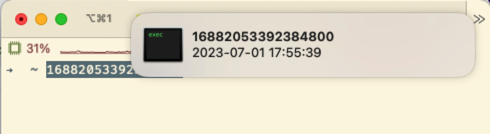
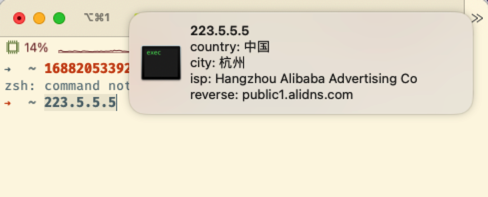

<!--
 * Copyright (c) 2023 by jimyag, All Rights Reserved. 
 * Licensed under the MIT License. See LICENSE file in the project root for license information.
-->
# mactools

## Description

Some small tools implemented using [macdriver](https://github.com/progrium/macdriver).

## Usage

### install task

Refer to [Task official](https://taskfile.dev/installation/) documentation

### build

```bash
task 
```

### run

```bash
task run
``` 

#### Parsing timestamps

It supports timestamps in seconds (10 digits), milliseconds (13 digits), microseconds (16 digits), hectonanoseconds (17 digits), and nanoseconds (19 digits) formats.  

For example, 16882053392384800 is a timestamp in the hectonanoseconds format, which corresponds to "2023-07-01 17:55:39" in human-readable format.

Copy the timestamp to the clipboard, and the app will parse it and send a notification.



#### Get ip info  

Copy the ip to the clipboard, and the app will parse it and send a notification.  




If you want to use a custom method to parse the clipboard content, please refer to [parse_ip](app/parse_ip_handle.go) and [timestamp_handle](app/timestamp_handle.go) for the implementation

## Expected or realized functions

- [ ] clipboard history
- [x] Parsing timestamps to send notifications
- [x] Parse ip address to send notification
- [x] Custom function
